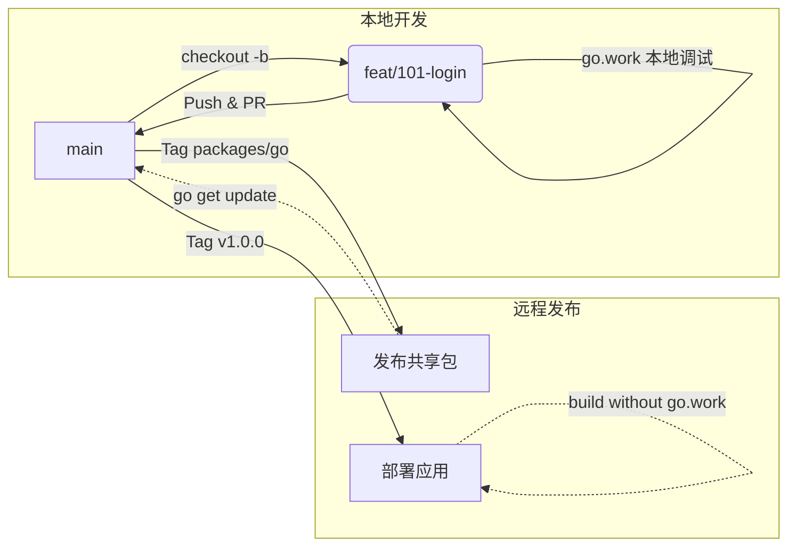

# GitHub Flow 分支管理规范 (Monorepo 版)

本文档基于 [GitHub Flow 标准规范](github-flow.md)，针对本项目的 **Monorepo (Go Workspaces)** 架构进行了扩展。在保留轻量级分支管理原则的同时，增加了对内部共享包（remote package）发布和依赖管理的说明。

## 一、 核心原则

1.  **Main 分支永远可发布**：`main` 分支时刻保持稳定，生产部署必须基于 `main` 分支的 Commit 或 Tag。
2.  **本地开发用 `go.work`**：在本地开发时，使用 `go.work` 引用本地模块，确保修改实时生效。
3.  **生产构建去 `go.work`**：生产环境构建 **严禁依赖本地路径**，必须依赖远程发布的 Go Module 版本。

---

## 二、 项目结构与包管理策略

### 1. 目录结构
本项目采用 Monorepo 结构，共享 Go 代码位于 `packages/go`。

```text
piemdm/
├── backend/
│   ├── go.mod (业务服务)
│   └── ...
├── packages/
│   └── go/ (共享 Go 库，如 openapi)
├── frontend/
│   └── ...
└── go.work (本地开发引用 backend & packages/go/openapi)
```

### 2. 内部包管理策略
| 包类型 | 开发引用方式 | 生产依赖方式 |
| :--- | :--- | :--- |
| **backend** (服务) | `go.work` 本地引用 | 独立构建，依赖远程发布的 shared 包 |
| **packages/go/openapi** | `go.work` 本地引用 | **发布到远程** (Tag)，backend `go.mod` 指向远程版本 |
| **packages/web/api-client** | `pnpm workspace` 本地引用 | 构建打包进前端应用 (无需独立 npm 发布) |

> **策略核心**：本地开发追求**快速迭代** (修改即生效)，生产构建追求**稳定性** (版本不可变)。

---

## 三、 工作流 (Workflow)

我们沿用标准的 GitHub Flow 分支命名（`feat/...`, `fix/...`），但在 CI/CD 和发布阶段有特殊处理。



### 1. 本地开发 (Local Development)

**环境配置**：
使用 `go.work` 同时包含业务模块和共享模块，修改共享代码时业务模块能直接感知。

```go
// go.work
go 1.24

use (
    ./backend
    ./packages/go/openapi
)
```

**分支操作**：
*   **创建**：`git checkout -b feat/123-new-api`
*   **提交**：`git commit -m "feat(api): add user endpoints"`
*   **PR**：推送到远程并发起 Pull Request。

### 2. 持续集成 (CI)
CI 需确保代码在 **不依赖 `go.work` 的情况下也能构建成功**。
*   **后端**：`go test ./...`
*   **前端**：`pnpm build`

### 3. 发布与部署 (Release & Deploy)

#### 第一步：发布共享包 (Remote Package)
若修改了 `packages/go/openapi`，需先发布版本。

1.  打 Tag 并推送：
    ```bash
    git tag packages/go/openapi/v1.2.0
    git push origin packages/go/openapi/v1.2.0
    ```

#### 第二步：更新依赖
在 `main` 分支（或新的 `chore` 分支）更新 `backend` 的 `go.mod`。

```bash
cd backend
go get github.com/pieteams/piemdm/packages/go/openapi@v1.2.0
go mod tidy
git commit -m "chore(deps): update openapi to v1.2.0"
git push
```

#### 第三步：应用部署
打应用版本 Tag（如 `v1.2.0`），触发生产构建。

> **⚠️ 关键点**：生产构建不使用 `go.work`，直接拉取远程依赖。

---

## 四、 紧急修复流程 (Fix)

当生产环境出现严重 Bug 需要紧急修复时，我们依然遵循标准的 **fix** 分支规范，但操作节奏更快：

1.  **创建 Fix 分支**：
    ```bash
    git checkout main
    git pull
    
    # 遵循 fix/<issue-id>-<desc> 或 fix/<desc>
    git checkout -b fix/critical-login-bug
    ```

2.  **修复与验证**：本地修复并验证通过。

3.  **合并与发版**：
    *   PR 合并回 `main`。
    *   打 Patch 版本 Tag (如 `v1.2.1`)。
    *   触发 CI/CD 自动部署。

---

## 五、 总结

| 阶段 | 依赖方式 | 关键操作 |
| :--- | :--- | :--- |
| **本地开发** | `go.work` (Local Path) | 修改代码 -> 本地测试 |
| **PR 审查** | `go.work` 或 Remote | CI 自动化测试 |
| **发布共享库** | Remote Version | `git tag packages/...` -> Push |
| **生产部署** | **Remote Version** (Strict) | 更新 `go.mod` -> Docker Build |
