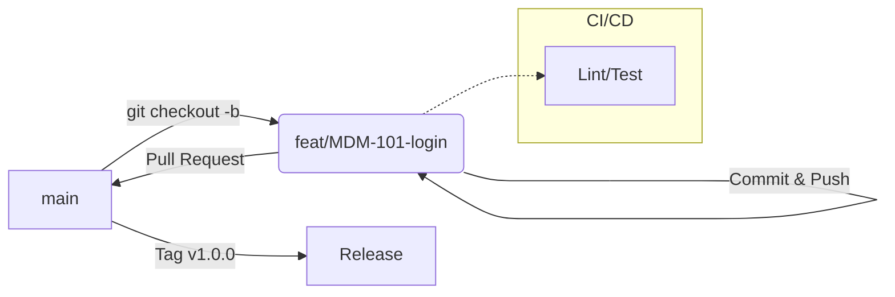

# GitHub Flow 分支管理规范

本文档基于业界最佳实践，制定了轻量级、协作成本低的分支管理规范。

## 一、 核心原则

1.  **Main 分支永远可发布**：`main` 分支时刻保持稳定状态。
2.  **分支即用即焚**：所有开发均在临时分支（Feature/Fix）进行，合并后立即删除。
3.  **通过 PR 合并**：禁止直接 Push 到 `main`，所有变更必须通过 Pull Request (PR) 审查后合并。

## 二、 分支命名规范

我们采用 **Prefix + Issue ID + Description** 的组合方式，既能一眼识别类型，又能关联需求/问题。

### 1. 命名格式

```text
<type>/<issue-id>-<description>
```

或者（如果不强制关联 Issue ID）：

```text
<type>/<description>
```

### 2. 分支类型（Prefix）

| 前缀 | 说明 | 适用场景 | 示例 |
| :--- | :--- | :--- | :--- |
| **feat** | 新功能 | 开发新特性、新功能 | `feat/MDM-123-batch-import` |
| **fix** | 修复 | 修复 Bug、缺陷 | `fix/BUG-45-null-pointer` |
| **docs** | 文档 | 仅修改文档、注释 | `docs/update-readme` |
| **refactor** | 重构 | 代码重构（不改变逻辑） | `refactor/config-loader` |
| **chore** | 杂项 | 构建过程、辅助工具变动 | `chore/upgrade-deps` |

> **❌ 不推荐的做法**：
> * 使用 `feature/xxx`（太长，视觉噪音大）
> * 使用 `feat-xxx`（连字符不利于工具分组）
> * 使用中文命名分支

### 3. 示例

*   **带有 Issue 编号（推荐）**：
    *   `feat/123-openapi-generator`
    *   `fix/456-deployment-error`
*   **不带 Issue 编号**：
    *   `feat/user-login`
    *   `docs/api-guide`

## 三、 工作流 (Workflow)



### 0. main 分支保护（建议先配置）

目的：避免误操作（force push、删除分支），并确保合并前必须通过 CI 检查与 Code Review。

在仓库页面配置：

1. 进入 `Settings` -> `Rules` -> `Rulesets`（或 `Settings` -> `Branches` -> `Branch protection rules`）
2. 创建规则集（Ruleset Name 可填 `Protect main`），Target 选择 `Branches`，分支匹配填 `main`
3. 推荐开启以下规则：
   - Require a pull request before merging（建议至少 1 个 Approving review）
   - Require status checks to pass before merging（选择 CI 的 lint/test 等检查）
   - Block force pushes
   - Restrict deletions

### 0.1 GitHub Actions 配置推荐（与本仓库现状对齐）

建议把 CI 检查做成 PR 必过的“硬门槛”，并把需要的检查项纳入 main 分支保护的 Required status checks。

本仓库已提供的工作流（文件位置：`.github/workflows/`）：

- `ci.yml`（CI）：PR 到 `main` 时跑后端测试、前端测试与构建；推到 `main` 时额外构建镜像
- `api-client.yml`（Generate API Client）：后端变更时校验 `shared/` 生成代码是否同步，未同步则让 PR 失败并留言提醒
- `docs.yml`（Docs）：仅在 `docs/site/**` 变更且推到 `main` 时构建并发布文档站点

main 分支保护建议纳入的 Required status checks（以 GitHub 页面实际显示名称为准）：

- `CI / test-backend`
- `CI / test-frontend`
- `Generate API Client / generate-api-client`（如果你希望强制生成代码永远同步）

通用推荐项（后续若调整工作流可按此对齐）：

- 触发条件：`pull_request` 优先，配合 `paths/paths-ignore` 降低无关变更的 CI 成本
- 缓存：Go 使用 `setup-go` 内置 cache；pnpm 使用 `pnpm/action-setup` 并配合 lockfile 固定依赖
- 权限：默认最小权限；需要写仓库时再显式开启 `permissions: contents: write`
- 约束：对 PR 使用 `concurrency`（同一分支新提交自动取消旧任务）避免排队与资源浪费

### 1. 开发新功能

首次参与项目或本地还没有仓库时，先把仓库拿到本地。这里取决于你是否有该仓库的写权限：

- 有写权限：直接 clone 官方仓库

```bash
git clone git@github.com:pieteams/piemdm.git
# 必须配置，否则本地无法对齐
git config pull.rebase true
cd piemdm
```

- 没有写权限（更常见的开源协作方式）：先 Fork 到自己的 GitHub 账号下，再 clone 自己的 fork，并添加上游仓库（upstream）用于同步

```bash
git clone git@github.com:<your_github_username>/piemdm.git
# 必须配置，否则本地无法对齐
git config pull.rebase true
cd piemdm

git remote add upstream git@github.com:pieteams/piemdm.git
# 必须配置，否则本地无法对齐
git config pull.rebase true
git remote -v
```

同步上游 `main`（建议在开始新功能前执行一次）：

```bash
git fetch upstream
git checkout main
git pull upstream main
```

从 `main` 分支创建功能分支：

```bash
# 1. 确保 main 是最新的
git checkout main
git pull origin main

# 2. 创建分支 (feat)
git checkout -b feat/MDM-101-login
```

### 2. 提交代码

遵循 [Conventional Commits](git-conventions.md) 规范提交：

```bash
git add .
git commit -m "feat(auth): implement login api"
```

### 3. 提交 PR (Pull Request)

```bash
# 推送到远程
git push origin feat/MDM-101-login
```

然后在 GitHub 页面创建 Pull Request，请求 Code Review。

### 4. 合并与清理

PR 被批准（Approved）并合并后：

```bash
# 1. 删除远程分支（GitHub 通常会自动删）
git push origin --delete feat/MDM-101-login

# 2. 删除本地分支
git checkout main
git pull
git branch -d feat/MDM-101-login
```

## 四、 版本发布

GitHub Flow 不需要维护长期的 `release` 或 `develop` 分支。发布直接基于 `main` 分支打 Tag。

```bash
# 发布 v1.2.0
git checkout main
git pull
git tag v1.2.0
git push origin v1.2.0
```

*   **CI/CD** 应监听 Tag 推送，自动构建 Docker 镜像并部署到生产环境。

## 五、 总结

*   ✅ **推荐**：`feat/xxx`, `fix/xxx`
*   ✅ **推荐**：关联 Issue ID，如 `feat/123-xxx`
*   ✅ **核心**：基于 `main` 开发，PR 合并，合并即发版（或随时可发版）。
